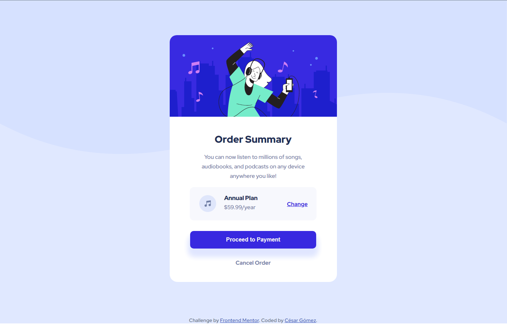

# Order summary card

This is a solution to the [Order summary card challenge on Frontend Mentor](https://www.frontendmentor.io/challenges/order-summary-component-QlPmajDUj). Frontend Mentor challenges help you improve your coding skills by building realistic projects. 

## Table of contents

- [Overview](#overview)
  - [The challenge](#the-challenge)
  - [Screenshot](#screenshot)
  - [Links](#links)
- [My process](#my-process)
  - [Built with](#built-with)
  - [What I learned](#what-i-learned)
  - [Continued development](#continued-development)
  - [Useful resources](#useful-resources)
- [Author](#author)
- [Acknowledgments](#acknowledgments)


## Overview

### The challenge

Users should be able to:

- See hover states for interactive elements

### Screenshot



### Links

- Solution URL: [https://github.com/CaesarAlej24/QR-code-component](https://github.com/CaesarAlej24/Order-summary-component)
- Live Site URL: [https://order-summary-component.vercel.ap](https://order-summary-component-1x5hih5u2-caesaralej24.vercel.app/)


## My process

### Built with

- Semantic HTML5 markup
- CSS custom properties
- Flexbox
- Mobile-first workflow


### What I learned

While doing this project i was able to learn about the basic workflow in a **CSS** layout, and in the same way about the principles of using *flex*, and how to use hover states for interactive elements. With this project i also improve the arrangement of the background images, that help me to have better abilities in the use of **CSS** and Flex, to reinforce my own knowledge.

Some code that i used:

```html
<div class="payment">
            <article>
              <h2>
                <button class="pay-button"><span>Proceed to Payment</span>
                </button>
              </h2>
              <p>
                <span>Cancel Order</span>
              </p>
            </article>
          </div>
```
```css
.pay-button::after {
    content: "";
    width: 100%;
    height: 100%;
    top: 0;
    left: 0;
    position: absolute;
    z-index: -1;
}

.pay-button:hover::after {
    background: hsl(225, 100%, 98%);
    opacity: 0.3;
}
```

### Continued development

I want to focus on developing my programming and design skills through the use of the different tools and programming languages that exist, like **HTML** , **CSS** , **JavaScript** , **Python** , **NodeJs** , **PL/SQL** .

### Useful resources

- [MDN Web Docs](https://developer.mozilla.org) - This helped me for the first steps. I liked these documenting web technologies and will use it going forward.
- [w3schools.com](https://www.w3schools.com/) - This is a powerful webpage to begin to learn to code, with a lot of useful tools and examples for beginners and advance developers.

## Author

- Website - [CésarGómez](https://www.your-site.com)
- Frontend Mentor - [@CaesarAlej24](https://www.frontendmentor.io/profile/CaesarAlej24)
- Twitter - [@yourusername](https://www.twitter.com/yourusername)

## Acknowledgments
 

